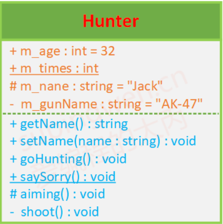
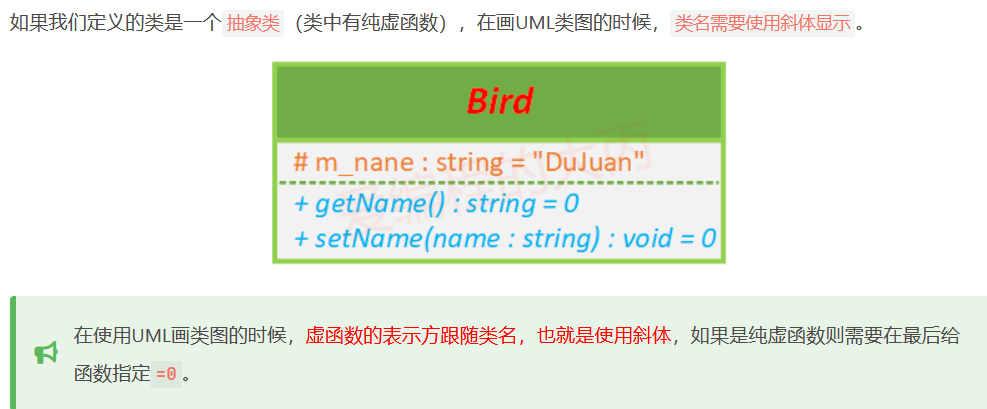
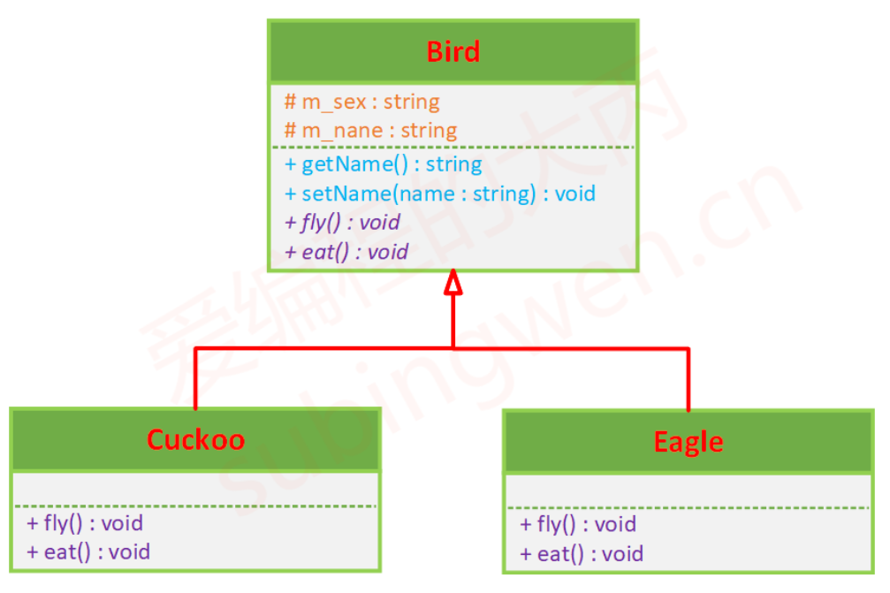
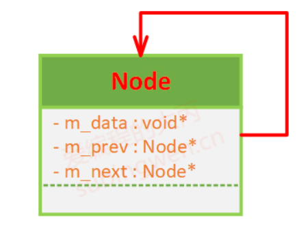
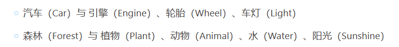
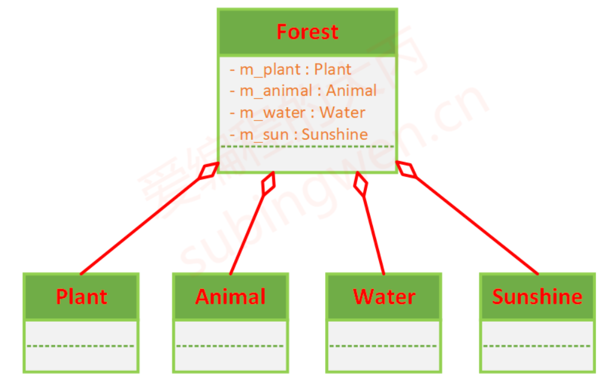
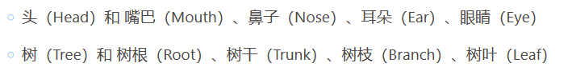
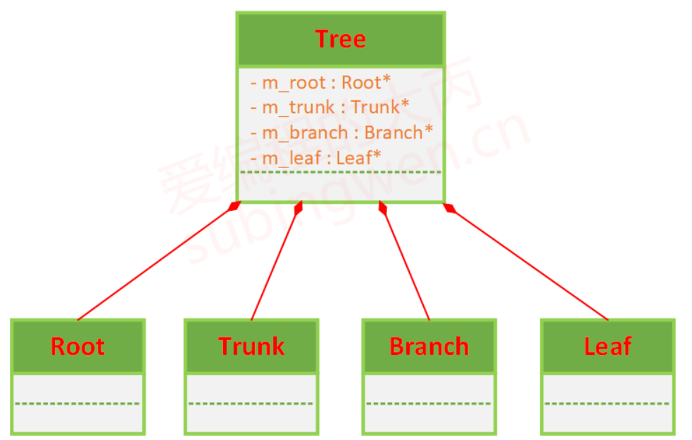
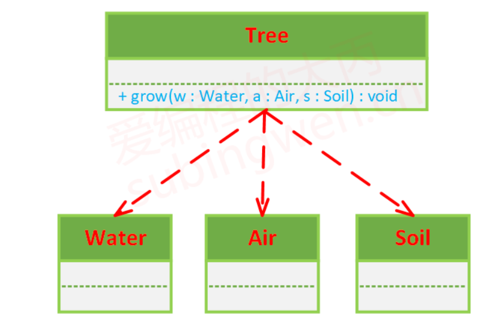
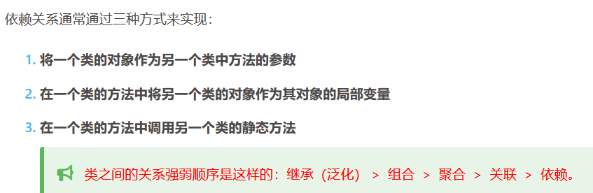

# UML学习

## pdf链接

[uml课程链接](https://subingwen.cn/design-patterns/UML-class-diagrams/)


## 类的UML画法

public -> +
protected -> #
private -> -
static -> __
ps:


抽象类是特殊的


## 类与类之间的关系

继承，关联，聚合，组合，依赖

### 继承



### 关联

单项关联，双向关联，自关联:
单项：父亲有儿子;
双向：父有子，子有父;
自关联：双向链表.


### 聚合

整体与部分，部分可以脱离整体存在，例如：



### 组合

整体与部分，部分不可以脱离整体存在，例如：



### 依赖

一种事物使用另一个事物，比如：
```cpp
class Water
{
};

class Air
{
};

class Soil
{
};

class Tree
{
public:
    void grow(Water w, Air a, Soil s) 
    {
        cout << "借助 w 中的水分, s 中的养分和 a 中的二氧化碳, 我就可以茁壮成长了";
    }
};
```




