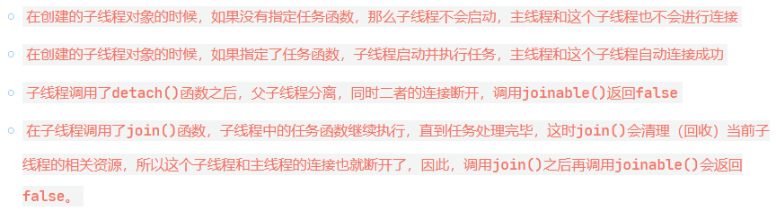

# c++11 thread

## 课程链接
[课程链接](https://subingwen.cn/cpp/thread/?highlight=thread)

## 公共成员函数

```cpp
//init thread
thread t(func);
//get thread id
t.get_id();
//thread join
/*
线程阻塞，在某个线程中通过子线程对象调用join()函数，调用这个函数的线程被阻塞，但是子线程对象中的任务函数会继续执行，当任务执行完毕之后join()会清理当前子线程中的相关资源然后返回，同时，调用该函数的线程解除阻塞继续向下执行。
函数在哪个线程中被执行，那么函数就阻塞哪个线程。
如果要阻塞主线程的执行，只需要在主线程中通过子线程对象调用这个方法即可，当调用这个方法的子线程对象中的任务函数执行完毕之后，主线程的阻塞也就随之解除了。
*/
t.join();
```

[相关代码](./getid.cpp)

```cpp
//thread detach()
/*
进行线程分离，分离主线程和创建出的子线程。在线程分离之后，主线程退出也会一并销毁创建出的所有子线程，在主线程退出之前，它可以脱离主线程继续独立的运行，任务执行完毕之后，这个子线程会自动释放自己占用的系统资源。
*/
t.detach();
```

[相关代码](./detach.cpp)


```cpp
joinable()用于判断主线程和子线程是否处理关联（连接）状态，true->有关，false->无关
t.joinable();
```

[相关代码](./joinable.cpp)

before starting, joinable: 0
after starting, joinable: 1
after joining, joinable: 0
after starting, joinable: 1
after detaching, joinable: 0



```cpp
//operator=  线程中的资源是不能被复制的，因此通过=操作符进行赋值操作最终并不会得到两个完全相同的对象。
// move (1)	
thread& operator= (thread&& other) noexcept;
// copy [deleted] (2)	
thread& operator= (const other&) = delete;

//如果other是一个右值，会进行资源所有权的转移
//如果other不是右值，禁止拷贝，该函数被显示删除（=delete），不可用
```

## 静态函数

thread线程类提供了静态方法获取当前计算机cpu核心数，根据这个结果在程序中创建出数量相等的线程。
每个线程独自占有一个CPU核心，这些线程就不用分时复用CPU时间片，此时程序的并发效率是最高的
```cpp
static unsigned hardware_concurrency() noexcept;
#include <iostream>
#include <thread>
using namespace std;

int main()
{
    int num = thread::hardware_concurrency();
    cout << "CPU number: " << num << endl;
}
```