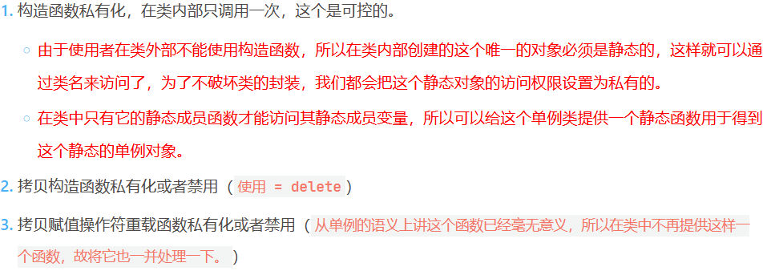
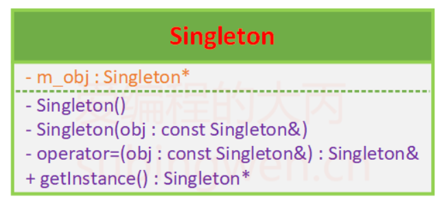
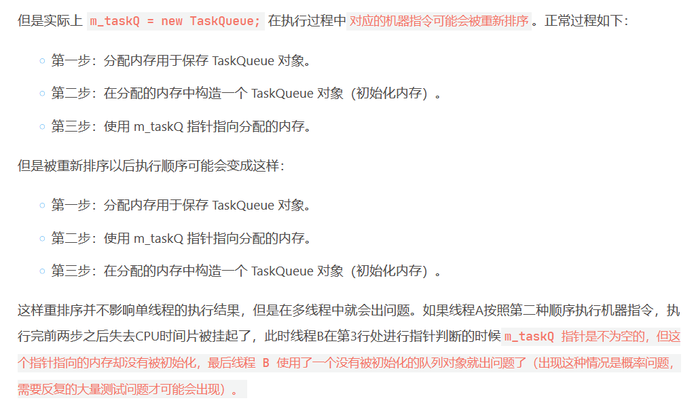
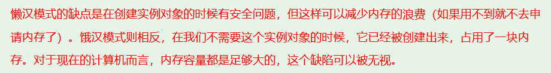

# 单例模式

## 课程链接

[课程链接](https://subingwen.cn/design-patterns/singleton/)

## 概念

在一个项目中，全局范围内，某个类的实例有且仅有一个，通过这个唯一实例向其他模块提供数据的全局访问，这种模式就叫单例模式。单例模式的典型应用就是任务队列。

要保证单例模式，即对类多对象操作的函数：构造函数()，拷贝构造函数(const T &t)，拷贝赋值操作符重载函数（=）。

所以针对单例模式，需要：

uml图如下



## 饿汉模式

饿汉模式，在类加载的时候就创建对象，不管有没有用到，都会创建对象。
对应代码如下：
[饿汉模式](./hungry_sample.cpp)
注意：类的静态成员变量在使用之前必须在类的外部进行初始化才能使用。

## 懒汉模式

懒汉模式，在类加载的时候不创建对象，在第一次调用的时候才创建对象。
对他代码如下：
[懒汉模式](./lazy_sample.cpp)

### 线程安全问题

懒汉模式存在线程安全问题，因为创建对象不是原子操作，所以可能存在多个线程同时创建对象，导致对象创建失败。
解决方案：
1. 懒汉模式加锁，双重检查锁定，但是加锁会影响性能。（if 0 中内容）
问题：在执行过程中对应的机器指令可能会被重新排序

使用原子变量atomic可以解决这个问题。
2. 懒汉模式使用静态局部变量，静态局部变量在函数调用之前进行初始化，不会出现线程安全问题。（if 1 中内容）（简单，推荐）
c++11: 如果指令逻辑进入一个未被初始化的声明变量，所有并发执行应当等待该变量完成初始化。


## 示例

[示例](./sample.cpp)

## 补充

### lock_guard

lock_guard是C++11新增的一个模板类，使用这个类，可以简化互斥锁lock()和unlock()的写法，同时也更安全。
```cpp
lock_guard<mutex> lock(m_mutex);
```
lock_guard构造函数会自动调用mutex的lock()函数，而析构函数会自动调用mutex的unlock()函数，所以不需要手动调用unlock()函数。
这种方式也有弊端，多个线程是线性的执行临界区代码的，因此临界区越大程序效率越低。

### =default 和 =delete

[链接](https://zhuanlan.zhihu.com/p/10387305)
在C++11标准中称= default修饰的函数为显式默认【缺省】（explicit defaulted）函数，而称=delete修饰的函数为删除（deleted）函数或者显示删除函数。

使用 =defaut 指定的默认函数和类提供的默认函数是等价的

```cpp
class Base
{
public:
    Base() = default;
    Base(const Base& obj) = default;
    Base(Base&& obj) = default;
    Base& operator= (const Base& obj) = default;
    Base& operator= (Base&& obj) = default;
    ~Base() = default;

    // 以下写法全部都是错误的
    Base(int a = 0) = default;
    Base(int a, int b) = default;
    void print() = default;
    bool operator== (const Base& obj) = default;
    bool operator>=(const Base& obj) = default;
};
```

=delete 表示显示删除，"显式删除可以避免用户使用一些不应该使用的类的成员函数"，使用这种方式可以有效的防止某些类型之间自动进行隐式类型转换产生的错误。
默认以及自定义函数都可以delete。

```cpp
class Base
{
public:
    Base() = default;
    Base(const Base& obj) = delete;
    Base& operator= (const Base& obj) = delete;
    void print(char c) = delete;
};

int main()
{
    Base b;
    Base tmp1(b);    // error
    Base tmp = b;    // error
    b.print('a');    // error
    return 0;
}
```

### 原子变量 atomic

原子变量是C++11新增的，原子变量可以保证操作的原子性，原子变量的构造函数需要一个类型为T的变量，原子变量的赋值操作符重载函数需要一个类型为T的变量，原子变量的加减操作符重载函数需要一个类型为T的变量。
(饿汉模式里面的修改)


