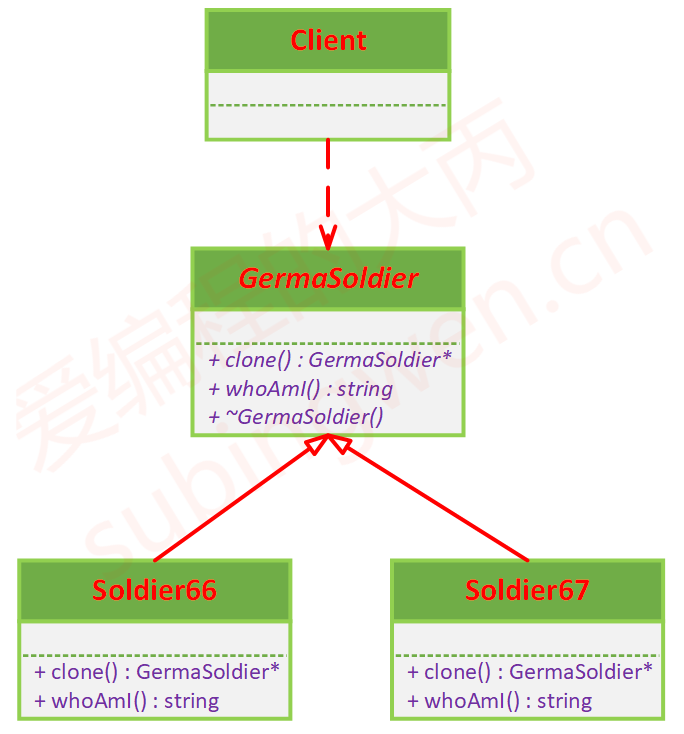

# 原型模式

## 课程链接

[课程链接](https://subingwen.cn/design-patterns/prototype/)

## 简介

克隆是一种最直接、最快捷的创建新对象的方式，它不仅隐藏了创建新对象的诸多细节，还保留了源对象的属性信息，保证了这两个对象能够一模一样。
原型模式就是能够复制已有的对象，而又无需使代码依赖它们所属的类。换种说法，就是通过已有对象克隆出另一个新的对象，并且克隆这个对象不需要使用构造函数。
克隆可能会在父类和子类之间进行，并且可能是动态的，很明显通过父类的拷贝构造函数无法实现对子类对象的拷贝，其实这就是一个多态，我们需要给父类提供一个克隆函数并且是一个虚函数。

## UML图

## 代码

