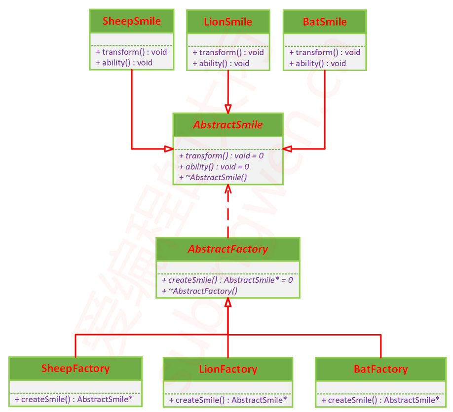

# 工厂模式

## 课程链接

[课程链接](https://subingwen.cn/design-patterns/factory/)

## 简介

简单工厂模式违反了开放-封闭原则，当新增加一个产品时，需要修改工厂类，违背了开闭原则。

使用工厂模式可以很完美的解决上述的问题，简单工厂模式是只有一个工厂类，而工厂模式是有很多的工厂类：

1. 一个基类，包含一个虚工厂函数，用于实现多态。
2. 多个子类，重写父类的工厂函数。每个子工厂类负责生产一种恶魔果实，这相当于再次解耦，将工厂类的职责再次拆分、细化，如果要生产新品种的恶魔果实，那么只需要添加对应的工厂类，无需修改原有的代码。

## UML类图

## 代码实现

[代码](./sample.cpp)

