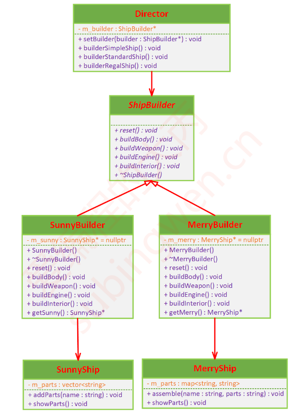

# 建造者模式(生成器模式)

## 课程链接

[课程链接](https://subingwen.cn/design-patterns/builder/)

## 简介

化繁为简，逐个击破。也就是分步骤创建复杂的对象，并且允许使用相同的代码生成不同类型和形式的对象。

生成器模式建议将造船工序的代码从产品类中抽取出来， 并将其放在一个名为生成器的独立类中。在这个生成器类中有一系列的构建步骤，每次造船的时候，只需从中选择需要的步骤并调用就可以得到满足需求的实例对象。

生成器内部的构建步骤不变。

主管类中非常适合放入各种例行构造流程，以便在程序中反复使用。此外， 对于客户端代码来说， 主管类完全隐藏了产品构造细节。 客户端只需要将一个生成器与主管类关联， 然后使用主管类来构造产品， 就能从生成器处获得构造结果了。
## UML类图

## 代码

[代码](./sample.cpp)