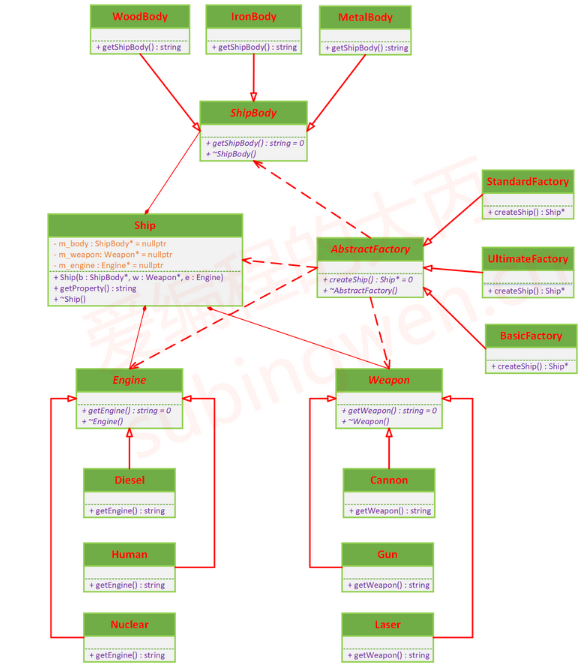
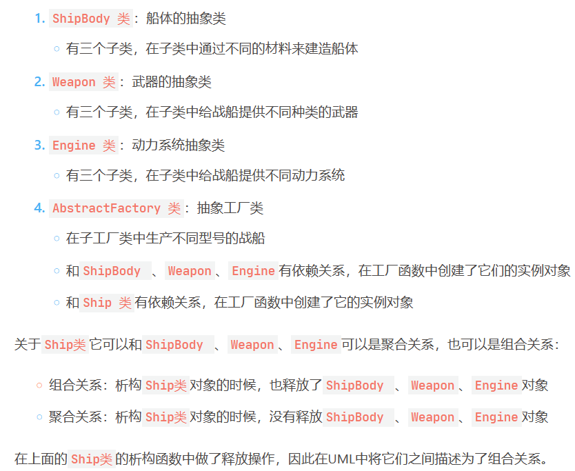

# 抽象工厂模式

## 课程链接

[课程链接](https://subingwen.cn/design-patterns/abstract-factory/)

## 简介

提供一个抽象的基类，然后在它的子类中完成各种型号的船的组装，每个子类对应的就是一条生产线。
抽象工厂模式：适用于比较复杂的多变的业务场景，总体上就是给一系列功能相同但是属性会发生变化的组件（如：船体材料、武器系统、动力系统）添加一个抽象类，这样就可以非常方便地进行后续的拓展，再搭配工厂类就可以创建出我们需要的对象了。

总结：

## UML类图

