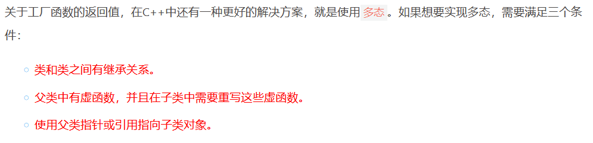

# 简单工厂模式

## 课程链接

[课程链接](https://subingwen.cn/design-patterns/simple-factory/)

## 简介

工厂模式其主要目的都是实现类与类之间的解耦合，这样我们在创建对象的时候就变成了拿来主义，使程序更加便于维护。
简单工厂模式，简单工厂模式是工厂模式中最简单的一种，它将类的实例化操作封装在一个工厂类中，客户端只需要知道要实例化的类，不需要知道实例化类的细节。

利用多态去完成。

## UML类图

## 代码

[代码](./sample.cpp)

注意：
1. 由于人造恶魔果实类有继承关系，并且实现了多态，所以父类的析构函数也应该是虚函数，这样才能够通过父类指针或引用析构子类的对象。（继承多态同时存在才需要虚析构函数，单纯继承不需要，否则会出现内存泄漏）
2. 工厂函数createSmile(Type type)的返回值修改成了AbstractSmile*类型，这是人造恶魔果实类的基类，通过这个指针保存的是子类对象的地址，这样就实现了多态，所以在main()函数中，通过obj对象调用的实际是子类BatSmile中的函数。