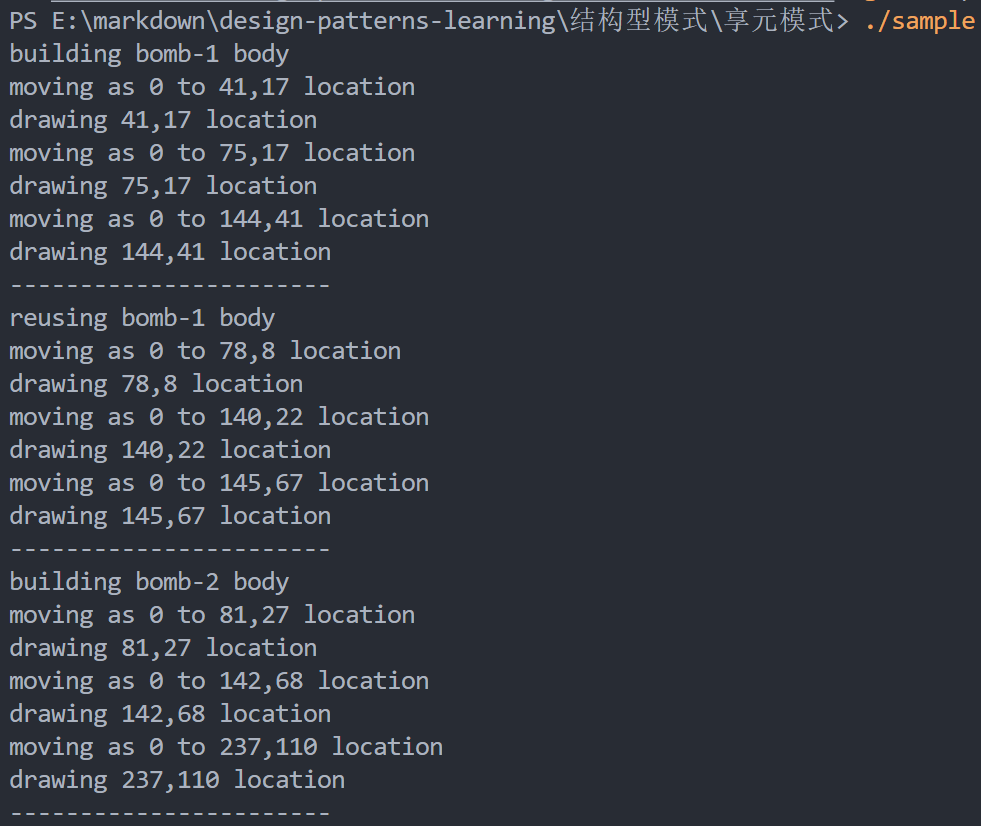

# 享元模式

## 课程链接

[课程链接](https://subingwen.cn/design-patterns/flyweight/)

## 简介

享元模式就是摒弃了在每个对象中都保存所有的数据的这种方式，通过数据共享（缓存）让有限的内存可以加载更多的对象。

对象的常量数据通常被称为内在状态，其位于对象中，其他对象只能读取但不能修改其数值。而对象的其他状态常常能被其他对象 “从外部” 改变，因此被称为外在状态。使用享元模式一般建议将内在状态和外在状态分离，将内在状态单独放到一个类中，这种类我们可以将其称之为享元类。

## UML类图

## 代码

[代码](./sample.cpp)

