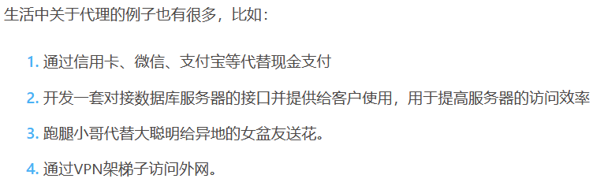
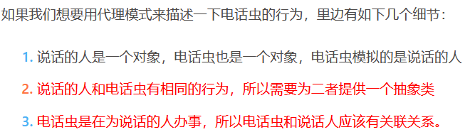
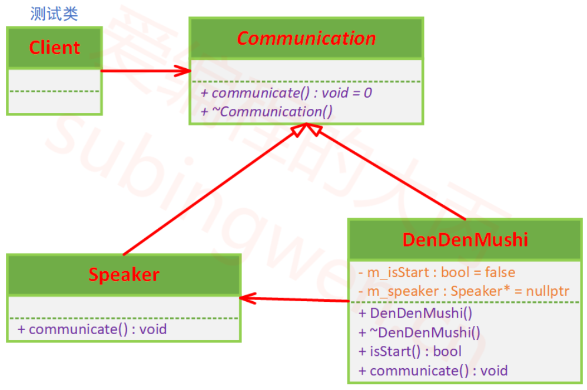
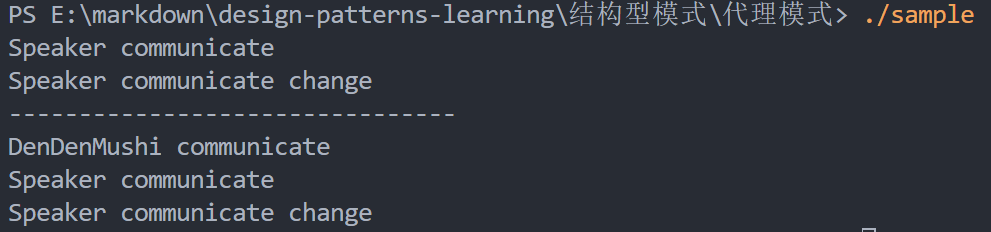

# 代理模式

## 课程链接

[课程链接](https://subingwen.cn/design-patterns/proxy/)

## 简介

为其他对象提供一种代理，以控制对这个对象的访问。

## UML类图

## 代码

[代码](./sample.cpp)

上面的测试程序中一共使用了两种方式进行通信，第二种使用的是代理模式，我们可以在代理类中有效的管理被代理的对象的工作的时机，但是并没有改变被代理的对象的行为。
通过测试程序我们可以得到如下结论：如果使用代理模式，不能改变所代理的类的接口，使用代理模式的目的是为了加强控制。
