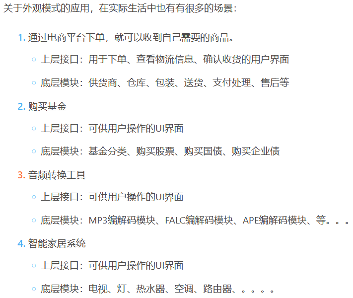
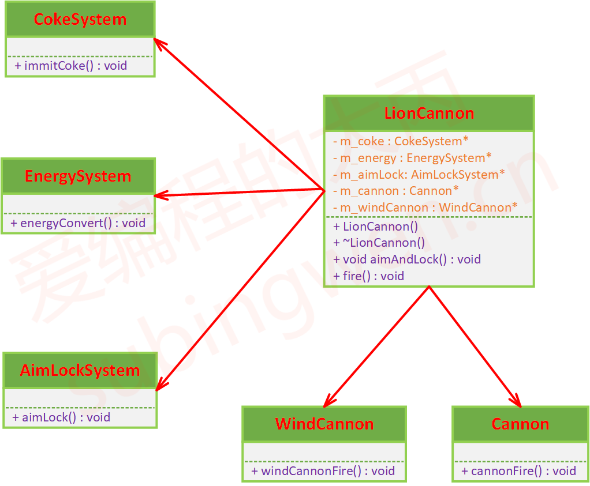
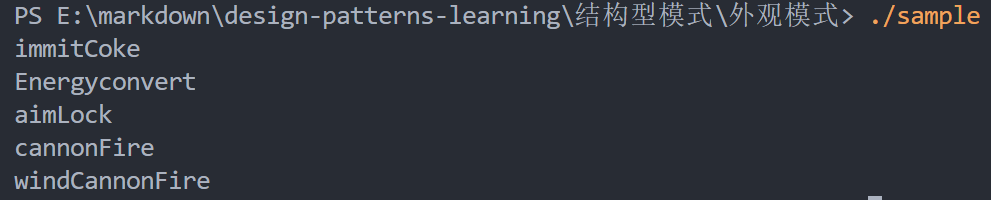

# 外观模式

## 课程链接

[课程链接](https://subingwen.cn/design-patterns/facade/)

## 简介

外观模式就是给很多复杂的子系统提供一个简单的上层接口，并在这些接口中包含用户真正关心的功能。

外观模式是一个很重要、平时也经常使用的设计模式，其核心思想就是化繁为简，封装底层逻辑，将使用者真正关心的功能通过上层接口呈现出来。

## UML类图

上层的接口和底层的各个模块之间应该是关联关系（因为类之间没有继承关系，也不是整体和部分这种结构，因此排除了聚合和组合，并且它们之间具有包含和被包含的关系，所以确定的关系是关联关系）

## 代码

[代码](./sample.cpp)

