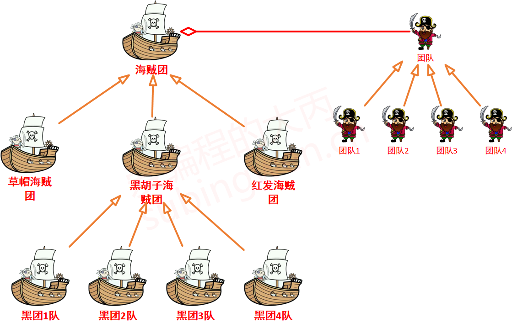
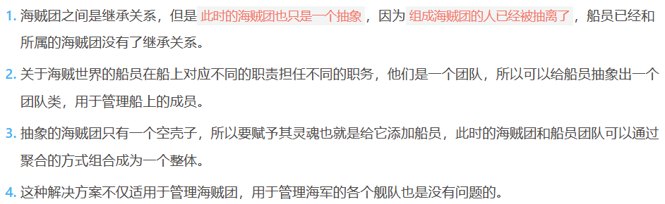
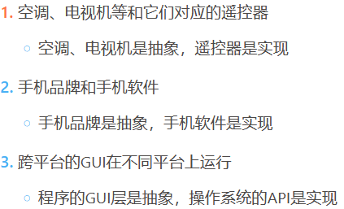
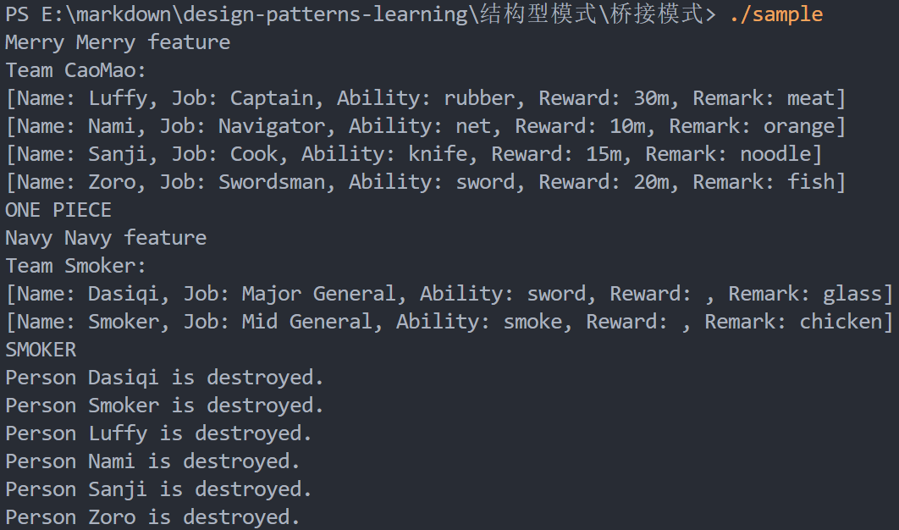
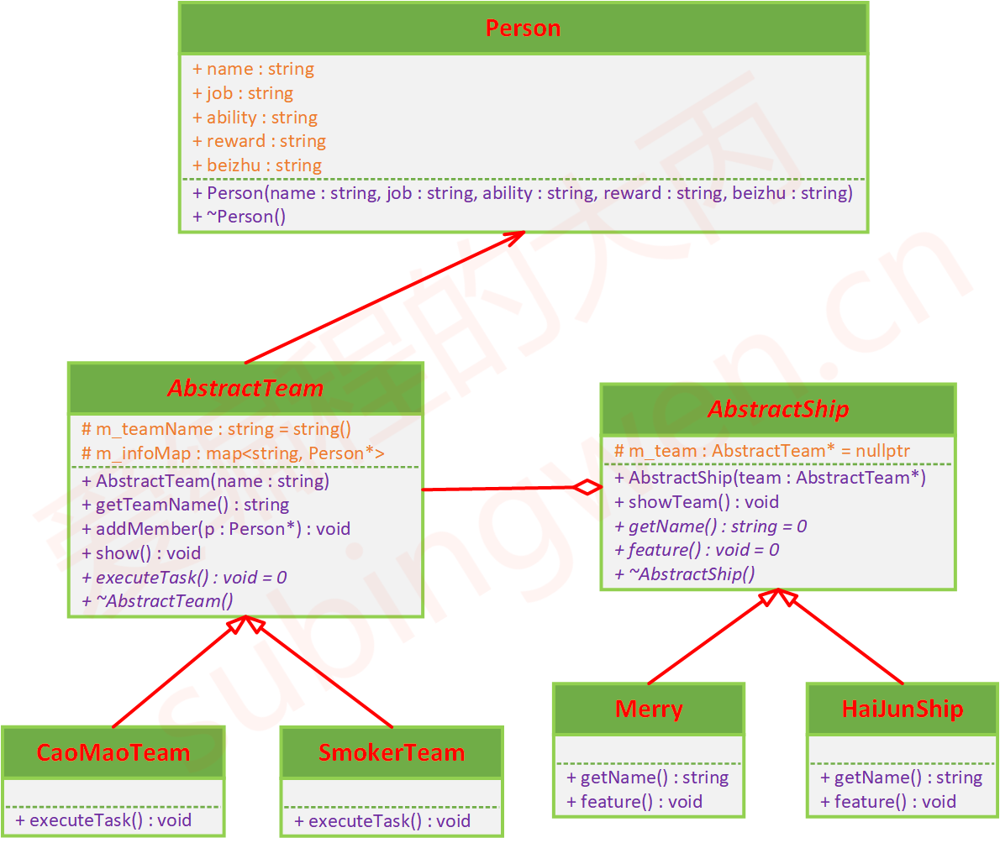

# 桥接模式

## 课程链接

[课程链接](https://subingwen.cn/design-patterns/bridge/)

## 简介

桥接模式（Bridge Pattern）是结构型设计模式。

将抽象部分和它的实现部分分离，使它们可以独立的变化，这种处理模式就是桥接模式。
应用场景:

## 代码

[代码](./sample.cpp)

对于一个海贼团或者一支海军部队来说，光有船是不完整的，船只是这个团队的抽象，如果想要让它鲜活起来就必要要有由人组成的团队，也就是抽象的具体实现。所以，在这个抽象类中包含了一个团队对象，船和团队二者之间的关系可以看做是聚合关系。

ps:
在C++中，`using AbstractTeam::AbstractTeam;` 是一个使用声明（using-declaration），它允许在派生类 `CaoMaoTeam` 中访问基类 `AbstractTeam` 的构造函数。这种语法在C++11及以后的版本中被引入，目的是为了解决在某些情况下，派生类构造函数的隐式继承可能不够明确的问题。
1. **构造函数继承**：
   当一个类继承自另一个类时，如果基类有一个构造函数与派生类的构造函数具有相同的参数列表，那么派生类的构造函数会隐式地继承基类的构造函数。
2. **明确性问题**：
   然而，如果基类中有多个构造函数，或者基类构造函数的参数列表与派生类构造函数的参数不完全一致，这种隐式继承可能会导致混淆或错误。
3. **使用声明**：
   `using AbstractTeam::AbstractTeam;` 这行代码明确告诉编译器，`CaoMaoTeam` 类希望使用基类 `AbstractTeam` 中名为 `AbstractTeam` 的构造函数。这是一种显式的继承声明，提高了代码的可读性和可维护性。
4. **好处**：
   - 它消除了对基类构造函数的隐式调用，使代码更加清晰。
   - 它允许派生类在没有自己的构造函数定义的情况下，直接使用基类的构造函数。
5. **示例**：
   在提供的代码中，`CaoMaoTeam` 类没有自己的构造函数定义。通过使用 `using` 声明，它直接使用基类 `AbstractTeam` 的构造函数，这样创建 `CaoMaoTeam` 对象时就会调用基类的构造函数来初始化 `m_teamName` 成员变量。
### 注意事项：

- 使用声明应该谨慎使用，以避免意外地隐藏重要的基类成员。
- 如果派生类需要添加自己的成员初始化或构造逻辑，它应该定义自己的构造函数，并且在构造函数内部显式地调用基类的构造函数（例如，使用 `AbstractTeam::AbstractTeam(name);`）。

输出：

## UML类图

