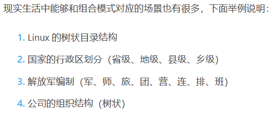
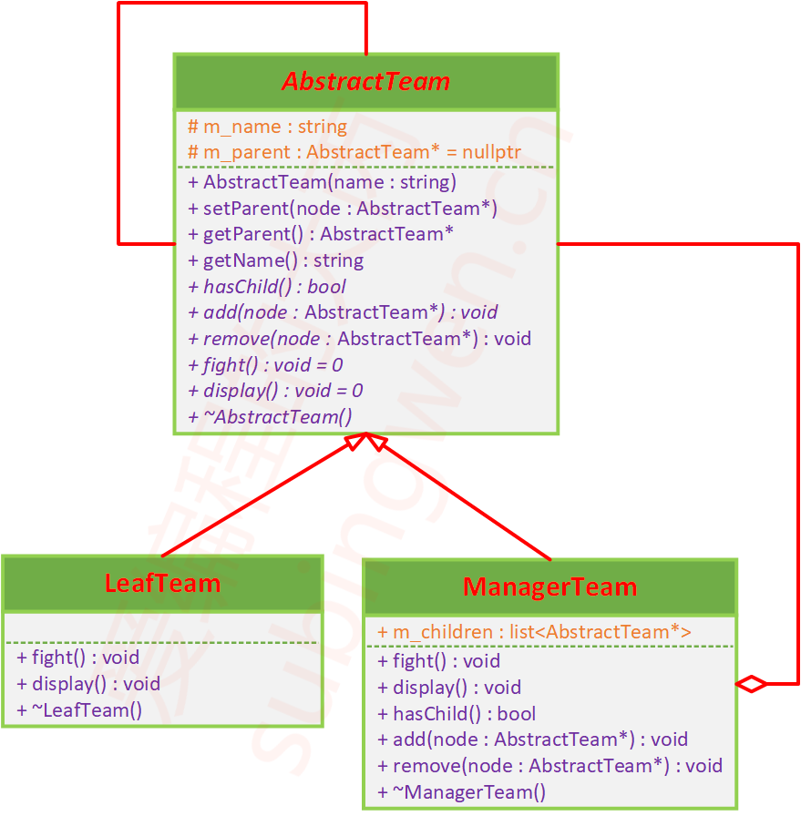
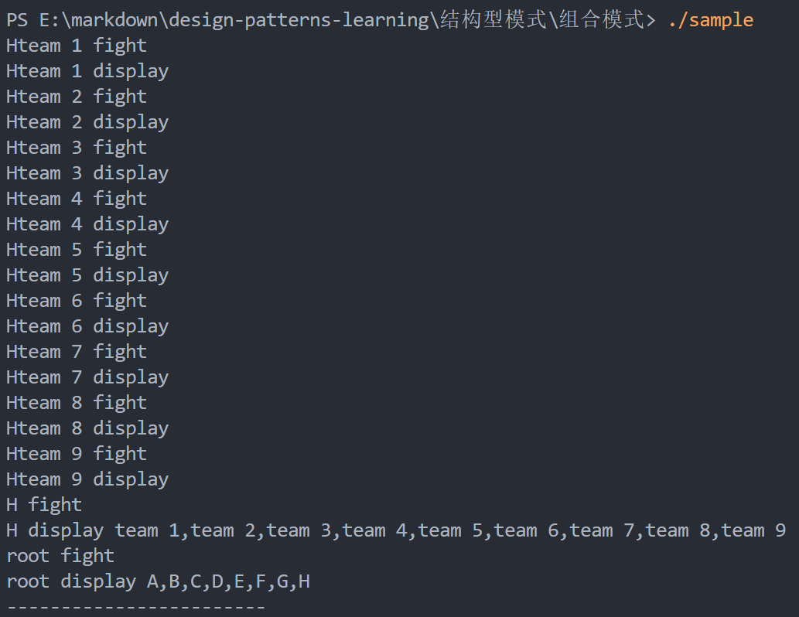
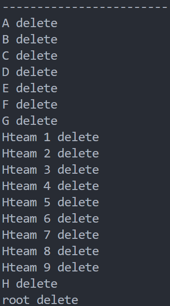

# 组合模式

## 课程链接

[课程](https://subingwen.cn/design-patterns/composite/)

## 简介

像草帽大船团这样，能将多个对象组成一个树状结构，用以描述部分—整体的层次关系，使得用户对单个对象和组合对象的使用具有一致性，这样的结构性设计模式叫做组合模式。

## UML类图

## 代码

[代码](./sample.cpp)

