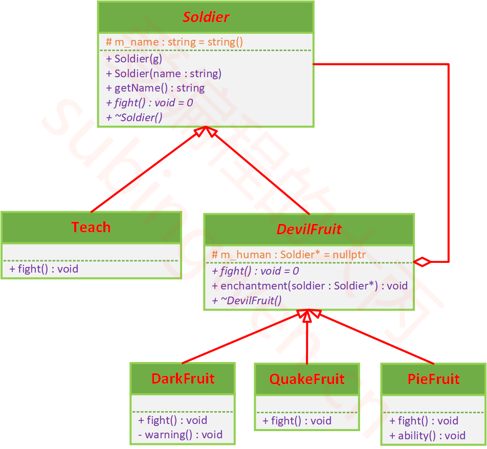
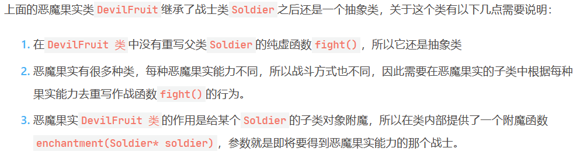
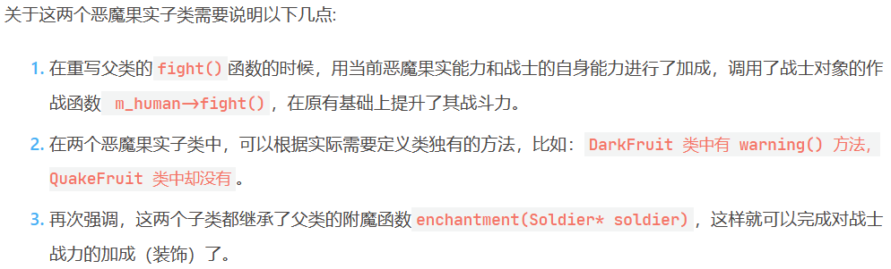
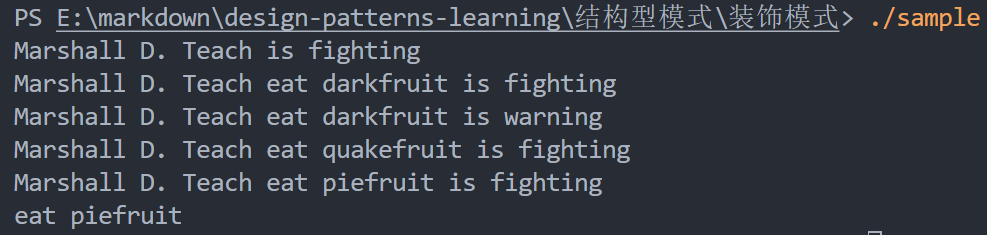

# 装饰模式

## 课程链接

[课程链接](https://subingwen.cn/design-patterns/decorator/)

## 简介

装饰模式（Decorator Pattern）允许向一个现有的对象添加新的功能，同时又不改变其结构。(动态改变)

装饰模式也可以称之为封装模式，所谓的封装就是在原有行为之上进行拓展，并不会改变该行为。封装之后数据只是变得更复杂了, 并没有改变它是数据的本质。

例子：网络通信

加解密是对数据的装饰，但是没有改变数据的本质。

## UML类图

## 代码

[代码](./sample.cpp)

