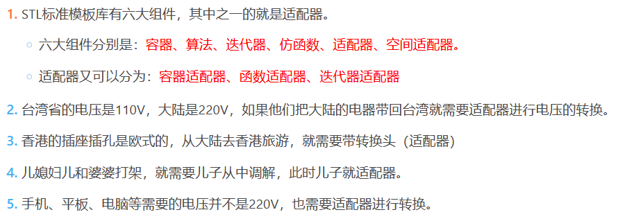
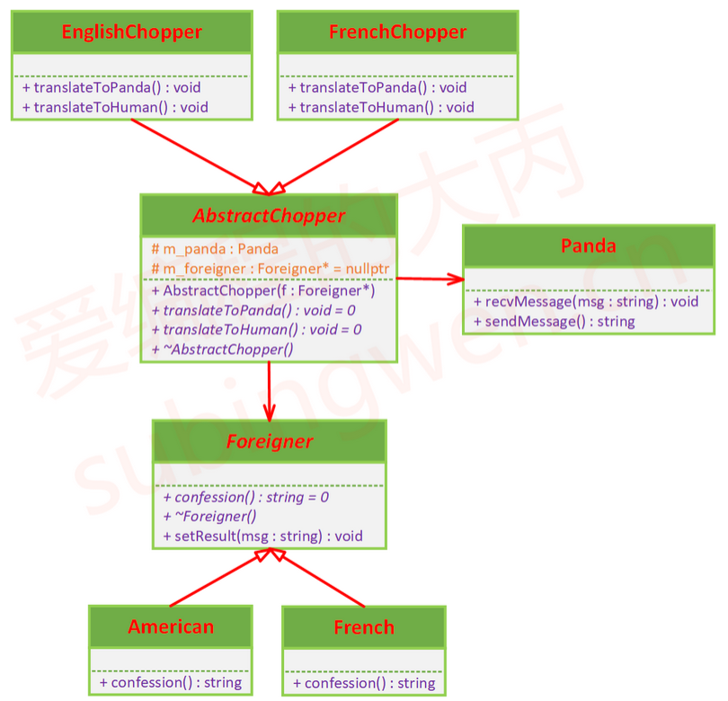

# 适配器模式

## 课程链接

[课程链接](https://subingwen.cn/design-patterns/adapter/)

## 简介

适配器模式（Adapter Pattern）是作为两个不兼容的接口之间的桥梁。这种类型的设计模式属于结构型模式，它结合了两个独立接口的功能。这种模式涉及到一个单一的类，该类负责加入独立的或不兼容的接口功能。
将一个类的接口转换成用户希望的另一个接口，使不兼容的对象能够相互配合并一起工作，这种模式就叫适配器模式。
例子如下:

## UML类图

关于适配器模式还有另外的一种实现方式：就是让适配器类继承它要为之提供服务器的类，也就是这个例子中的外国人类和熊猫类（如果外国人来没有子类可以使用这种方式），这种解决方案要求使用的面向对象的语言支持多继承，对于这一点C++是满足要求的，但是很多其它面向对象的语言不支持多继承。

## 代码
[代码](./sample.cpp)
