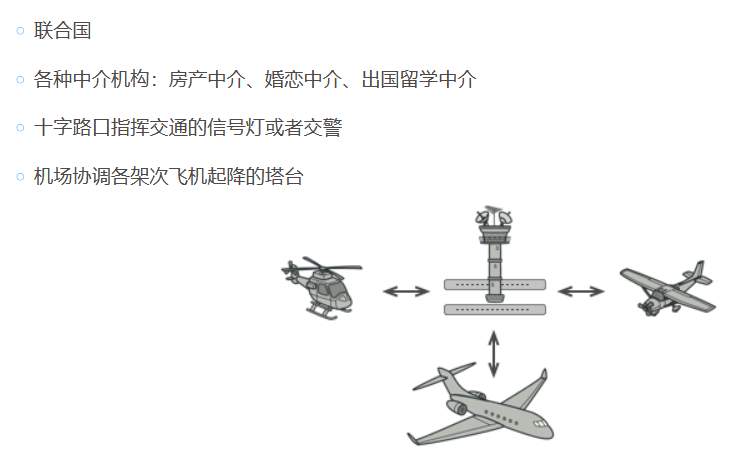
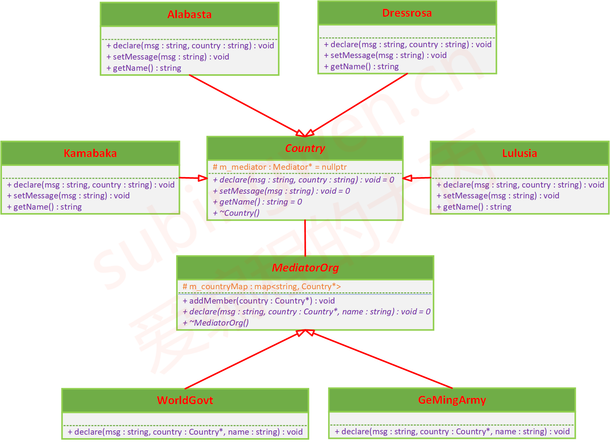

# 中介者模式

## 课程链接

[课程链接](https://subingwen.cn/design-patterns/mediator/)

## 简介

中介者模式可以减少对象之间混乱无序的依赖关系，从而使其耦合松散，限制对象之间的直接交互，迫使它们通过一个中介者对象进行合作。

## UML类图

当一些对象和其他对象紧密耦合以致难以对其进行修改时；当组件因过于依赖其他组件而无法在不同应用中复用时；当为了能在不同情景下复用一些基本行为，导致需要被迫创建大量组件子类时，都可使用中介者模式。

## 代码

[代码](./sample.cpp)

