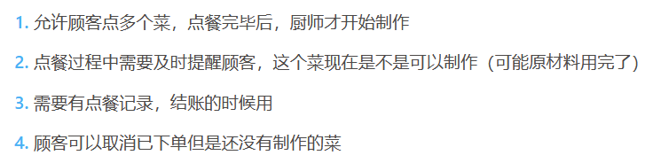
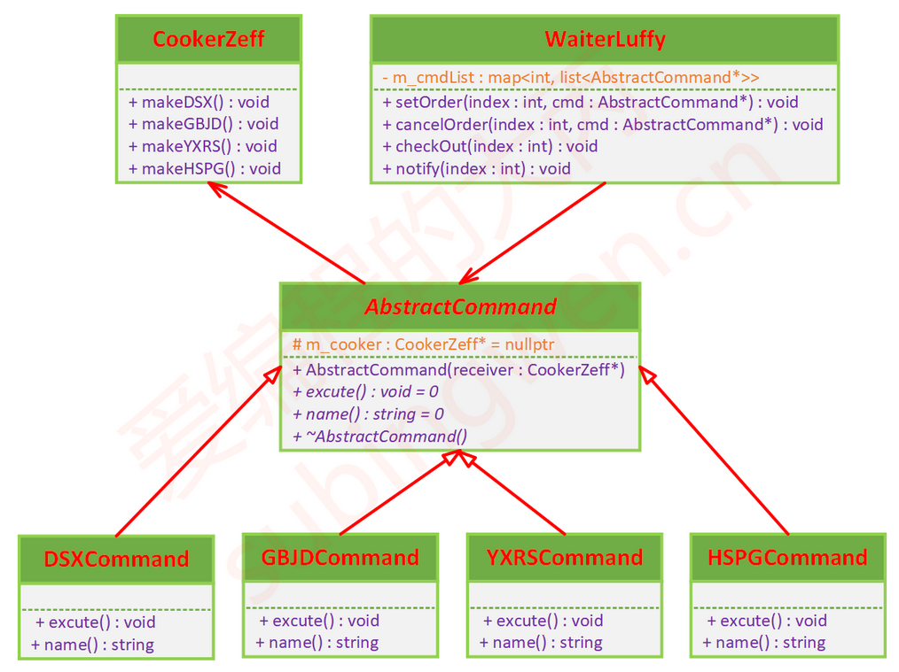
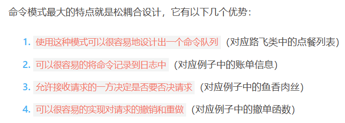
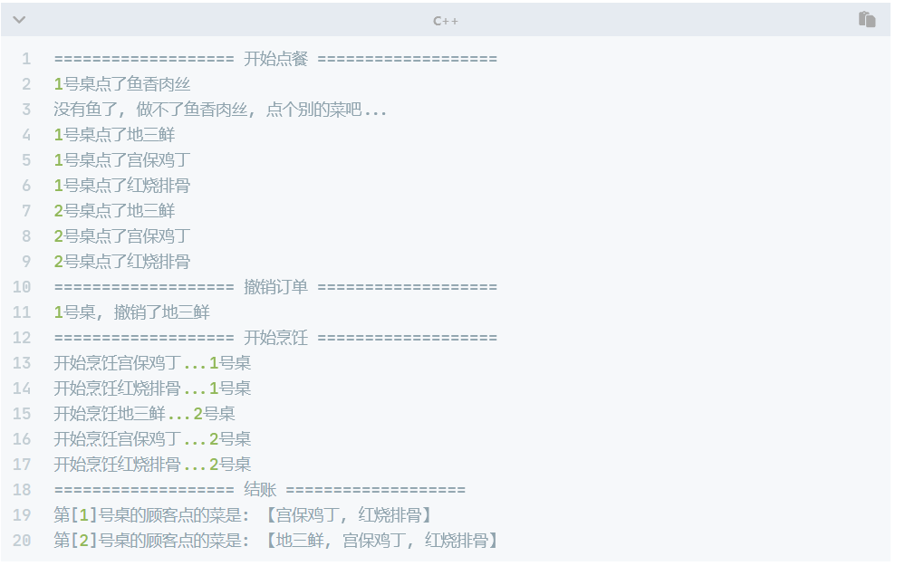

# 命令模式

## 课程链接

[课程链接](https://subingwen.cn/design-patterns/command/)

## 简介

需求：

命令模式就是将请求转换为一个包含与请求相关的所有信息的独立对象，通过这个转换能够让使用者根据不同的请求将客户参数化、 延迟请求执行或将请求放入队列中或记录请求日志， 且能实现可撤销操作。

## UML类图

## 代码

[代码](./sample.cpp)

顾客下单就是命令模式中的命令，这些命令的接收者是厨师，命令被分离出来实现了和厨师类的解耦合。通过这种方式可以控制命令执行的时机，毕竟厨师都是在顾客点餐完毕之后才开始炒菜的。

在命令模式中，服务员类是命令的调用者，顾客点餐完成之后服务员调用这些命令，命令的接收者也是执行者 – 厨师就开始给顾客做菜了。

