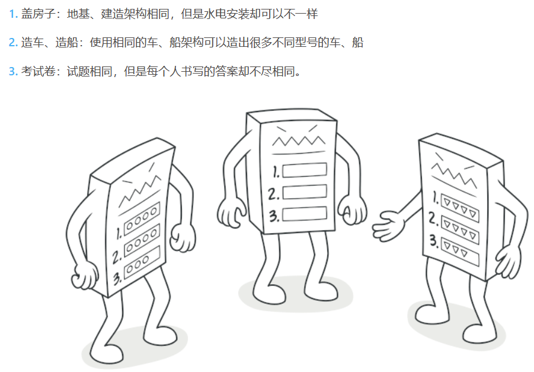
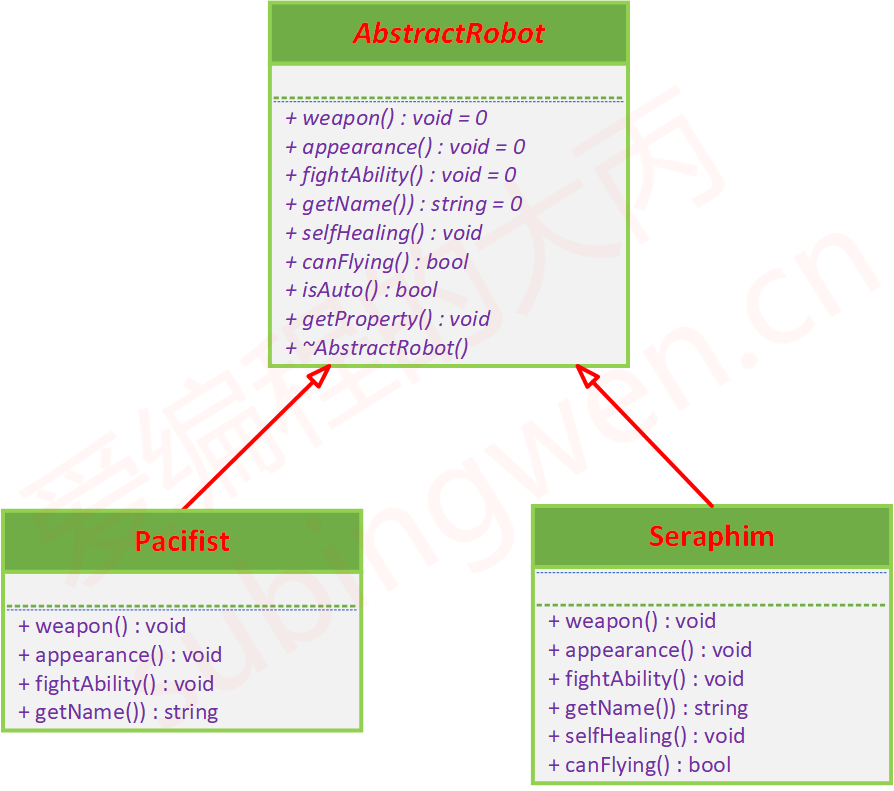
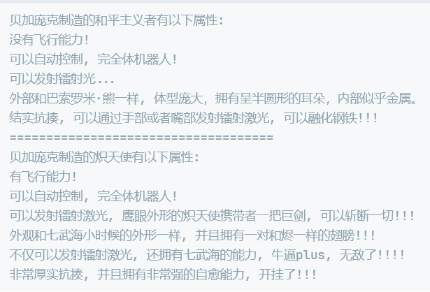

# 模板方法模式

## 课程链接

[课程链接](https://subingwen.cn/design-patterns/template-method/)

## 简介

模板方法模式就是在基类中定义一个算法的框架，允许子类在不修改结构的情况下重写算法的特定步骤。说的再直白一些就是先定义一个基类，在基类中把与需求相关的所有操作函数全部作为虚函数定义出来，然后在这个基类的各个子类中重写父类的虚函数，这样子类基于父类的架构使自己有了和其他兄弟类不一样的行为。

## UML类图

我们在实现子类的时候，如果发现不变的行为和可变的行为混合在了一起，导致不变的行为在多个子类中重复出现，此时就可以使用模板方法模式把不变的行为搬到基类中，去除子类里边的重复代码，来体现它的优势，模板方法模式就是提供了一个很好的代码复用平台。

## 代码

[代码](./sample.cpp)

