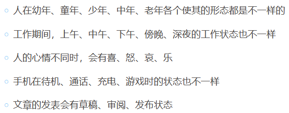
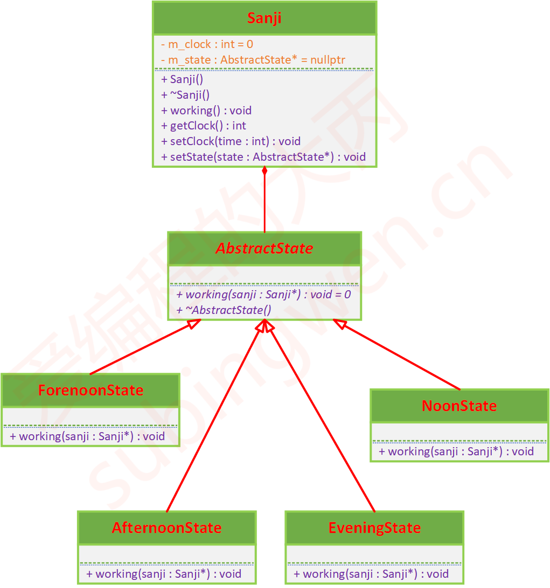
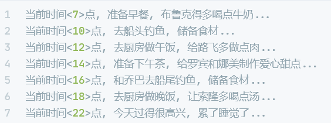

# 状态模式

## 课程链接

[课程链接](https://subingwen.cn/design-patterns/state/)

## 简介

状态模式就是在一个类的内部会有多种状态的变化，因为状态变化从而导致其行为的改变，在类的外部看上去这个类就像是自身发生了改变一样。

状态模式和策略模式比较类似，策略模式中的各个策略是独立的不关联的，但是状态模式下的对象的各种状态可以是独立的也可以是相互依赖的

另外我们可以看到状态模式下各个模式之间是可以有依赖关系的，这一点和策略模式是有区别的，策略模式下各个策略都是独立的，当前策略不知道有其它策略的存在。

如果对象需要根据当前自身状态进行不同的行为， 同时状态的数量非常多且与状态相关的代码会频繁变更或者类对象在改变自身行为时需要使用大量的条件语句时，可使用状态模式。

## UML类图

## 代码

[代码](./sample.cpp)

