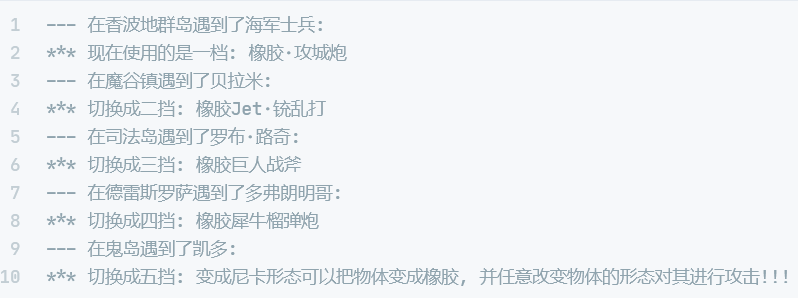

# 策略模式

## 课程链接

[课程链接](https://subingwen.cn/design-patterns/strategy/)

## 简介

策略模式需要我们定义一系列的算法，并且将每种算法都放入到独立的类中，在实际操作的时候使这些算法对象可以相互替换。

策略模式中的若干个策略对象相互之间是完全独立的， 它们不知道其他对象的存在。当我们想使用对象中各种不同的算法变体，并希望能够在运行的时候切换这些算法时，可以选择使用策略模式来处理这个问题。 

## UML类图

## 代码

[代码](./sample.cpp)

