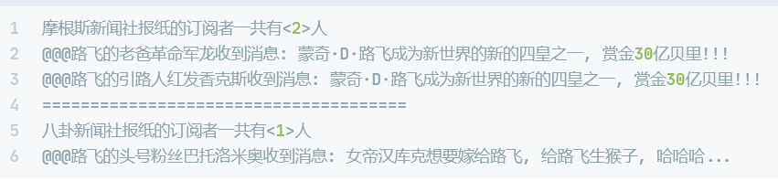

# 观察者模式

## 课程链接

[课程链接](https://subingwen.cn/design-patterns/observer/)

## 简介

观察者模式允许我们定义一种订阅机制，可在对象事件发生时通知所有的观察者对象，使它们能够自动更新。观察者模式还有另外一个名字叫做“发布-订阅”模式。

应用场景：当一个对象的状态发生变化，并且需要改变其它对象的时候；或者当应用中一些对象必须观察其它对象的时候可以使用观察者模式。

## UML类图

## 代码

[代码](./sample.cpp)

