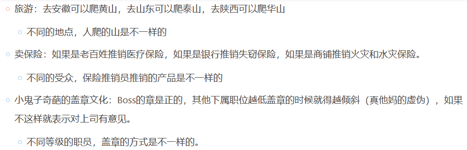
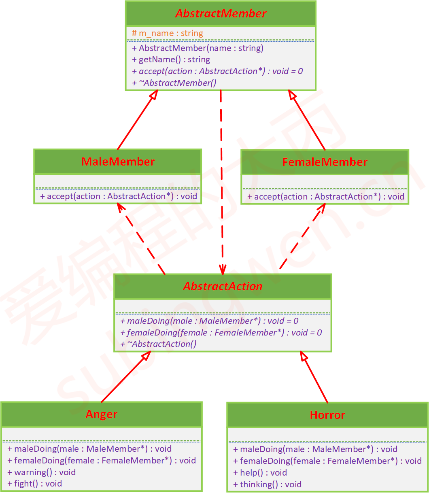
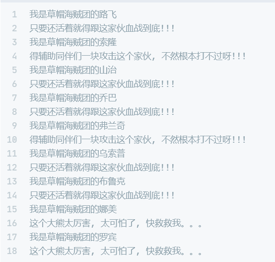

# 访问模式

## 课程链接

[课程链接](https://subingwen.cn/design-patterns/visitor/)

## 简介

如果草帽团的某些成员在面对大熊攻击时的状态反应是一样的，那么在这些子类中就会出现很多相同的冗余代码。有一种更好的处理思路就是将状态和人分开，其中草帽团的各个成员我们可以看做是对象，草帽团成员的反应和状态我们可以将其看做是算法，这种将算法与其所作用的对象隔离开来的设计模式就叫做访问者模式，其实就是通过被分离出的算法来访问对应的对象。

## UML类图

## 代码

[代码](./sample.cpp)

访问者模式适用于数据结构比较稳定的系统，对于上面的例子而言就是指草帽团成员：只有男性和女性（不会再出现其它性别）。在剥离出的行为状态类中针对男性和女性提供了相对应的 doing 方法。这种模式的优势就是可以方便的给对象添加新的状态和处理动作，也就是添加新的 AbstractAction 子类（算法类），在需要的时候让这个子类去访问某个成员对象，访问者模式的最大优势就是使算法的增加变得更加容易维护。

如果不按照性别进行划分，草帽团一共9个成员就需要在行为状态类中给每个成员提供一个 doing 方法，当草帽团又添加了新的成员，状态类中也需要给新成员再添加一个对应的 doing 方法，这就破坏了设计模式的开放 – 封闭原则。
