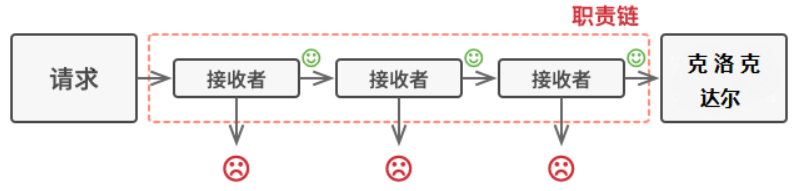
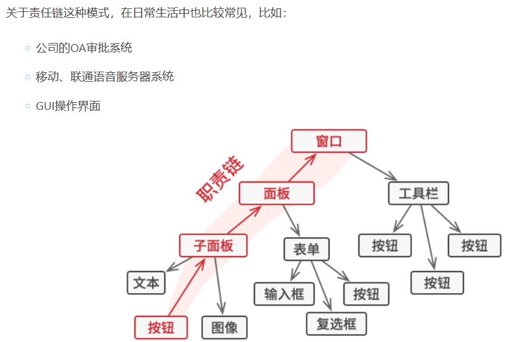
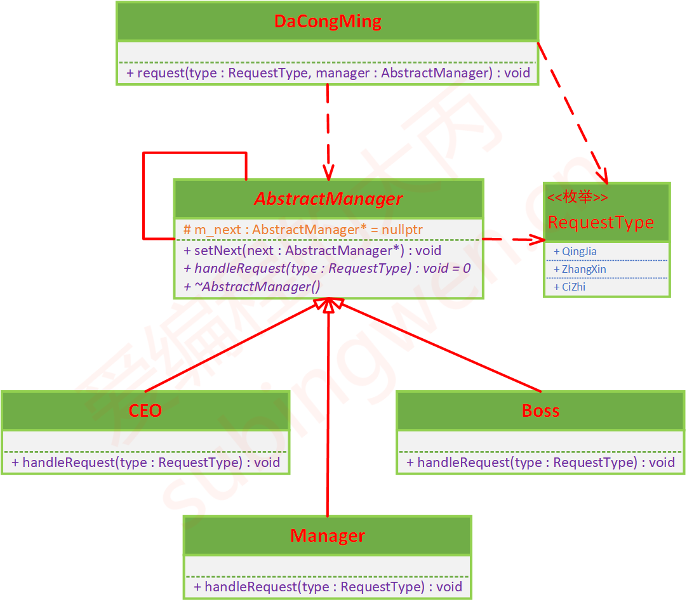
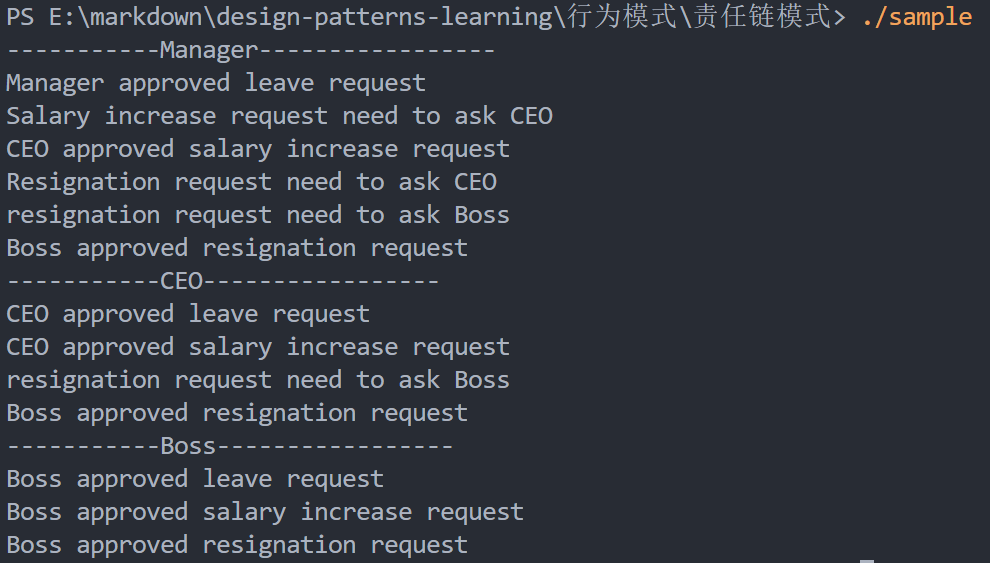

# 责任链模式

## 课程链接

[课程链接](https://subingwen.cn/design-patterns/chain/)

## 简介

像上面这种将对象连成一条链，并沿着这条链传递请求，直到链上有一个对象将请求处理掉为止，这种处理数据的模式叫做责任链模式。使用这种模式有一个好处：处理者可以决定不再沿着链传递请求， 这可高效地取消所有后续处理步骤。

责任链模式就是将这些处理者连成一条链。 链上的每个处理者都有一个成员变量来保存下一个处理者。 除了处理请求外， 处理者还负责沿着链传递请求， 请求会在链上移动， 直至所有处理者都有机会对其进行处理。

## UML类图

## 代码

[代码](./sample.cpp)
