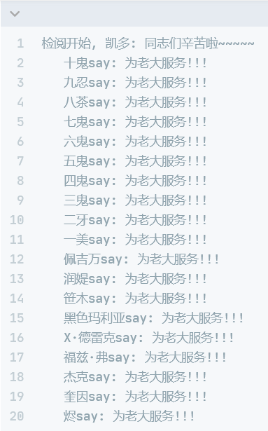

# 迭代器模式

## 课程链接

[课程链接](https://subingwen.cn/design-patterns/iterator/)

## 简介

提供一种解决方案使其能够顺序访问一个集合对象中的各个元素，而又不暴露该集合底层的表现形式（列表、栈、树、图等）

如果想要遍历上面的链表集合，有两种方式：一种是正向遍历，一种是逆向遍历，不论哪一种遍历方式它们都对应相同的操作接口，所以需要先提供一个抽象的迭代器基类。通过代器接口访问上面的双向链表的时候，我们只知道它是一个容器，至于其内部的数据结构已经全部被隐藏了。

## UML类图

## 代码

[代码](./MyList.cpp)
