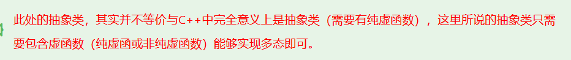
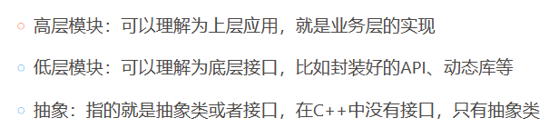
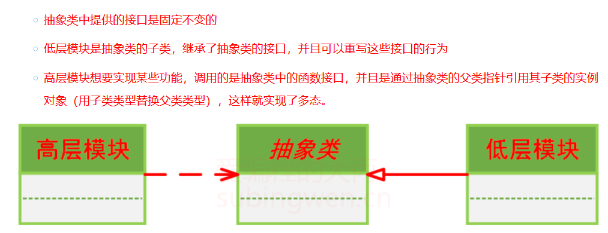

# 设计模式原则

## 单一职责原则

单一职责原则（Single Responsibility Principle）是指一个类应该只负责一项职责，一个类应该只有一个引起它变化的原因。
1. 降低类的复杂度，提高类的可读性，可维护性。
2. 降低变更引起的风险。

## 开放封闭原则

开放封闭原则（Open Closed Principle）是指一个软件实体应该对扩展开放，对修改关闭。

例如：设计一个基类，然后根据不同的需求，继承这个基类，然后根据不同的需求，重写基类中的方法。
基类一般设计为接口，比如图像类，有计算周长和面积的方法，可以有圆形、正方形、矩形等派生类继承这个基类，然后根据不同的需求，重写基类中的方法，调用该方法获取面积以及周长。



## 里氏代换原则

子类类型必须能够替换掉它们的父类类型
比如在Qt中，所有窗口类型的类的构造函数都有一个QWidget*类型的参数（QWidget 类是所有窗口的基类）
这个原则的要满足的第一个条件就是继承，其次还要求子类继承的所有父类的属性和方法对于子类来说都是合理的。

## 依赖倒置原则

依赖倒置原则（Dependency Inversion Principle）是指：
1. 高层模块不应该依赖低层模块，它们都应该依赖其抽象。
2. 抽象不应该依赖细节，细节应该依赖抽象。

其实就是利用多态性




```cpp
// 定义一个抽象的组件接口
class Component {
public:
    virtual ~Component() {}
    virtual void doOperation() = 0; // 纯虚函数，定义接口
};

// 实现一个具体的组件
class ConcreteComponent : public Component {
public:
    void doOperation() override {
        // 实现具体的操作
        std::cout << "ConcreteComponent is performing an operation." << std::endl;
    }
};

// 定义一个高层策略接口，它依赖于抽象的组件接口
class Strategy {
public:
    virtual ~Strategy() {}
    virtual void executeWithComponent(Component* component) = 0; // 依赖于抽象
};

// 实现一个具体的策略，它使用组件接口而不是具体的组件实现
class ConcreteStrategy : public Strategy {
public:
    void executeWithComponent(Component* component) override {
        component->doOperation(); // 使用抽象的Component接口
    }
};

int main() {
    // 创建具体的组件和策略对象
    ConcreteComponent component;
    ConcreteStrategy strategy;

    // 策略对象持有组件接口的指针，这里注入具体的组件实现
    Strategy* myStrategy = &strategy;
    myStrategy->executeWithComponent(&component);

    return 0;
}
```

Component 是一个组件接口，定义了一个 doOperation() 操作。
ConcreteComponent 是 Component 接口的一个具体实现，提供了 doOperation() 操作的具体行为。
Strategy 是一个高层策略接口，它定义了一个 executeWithComponent() 方法，该方法接受一个 Component 接口的指针作为参数。这样，策略接口依赖于抽象的 Component 接口，而不是任何具体的组件实现。
ConcreteStrategy 是 Strategy 接口的一个具体实现，它通过 Component 接口与组件进行交互，而不是直接依赖于 ConcreteComponent。
在 main() 函数中，我们创建了一个 ConcreteComponent 对象和一个 ConcreteStrategy 对象。然后，我们将策略对象 strategy 传递给高层模块，并通过策略对象调用 executeWithComponent() 方法，将组件对象作为参数传递进去。这样，高层模块（策略）不直接依赖于低层模块（具体组件实现），而是依赖于抽象（组件接口）

## 接口隔离原则

不应该强迫客户依赖于它们不使用的方法。一个好的接口应该尽可能小且紧凑，只包含一个客户端需要的方法。

1. 单一职责原则: 一个计算器类只负责计算功能，不负责文件读写或网络通信。
2. 开闭原则: 如果需要添加新的功能，如支持新的文件格式，应通过继承或组合来扩展现有类，而不是修改现有类的代码。
3. 里氏替换原则: 一个图形接口有一个 draw() 方法，圆形和正方形类实现了这个接口。任何使用图形接口的地方都应该能够无缝替换为圆形或正方形对象。
4. 依赖倒置原则: 一个支付系统不直接依赖于具体的支付网关类，而是依赖于一个抽象的支付接口，这样当需要更换支付网关时，不需要修改支付系统的代码。
5. 接口隔离原则: 一个报表系统需要数据访问接口来获取数据，而不是数据访问接口中的打印或存储方法，这些方法对报表系统来说是多余的。


